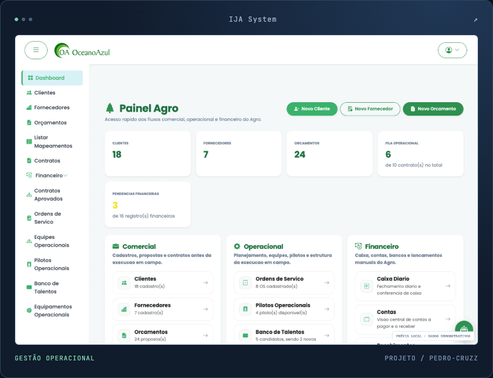
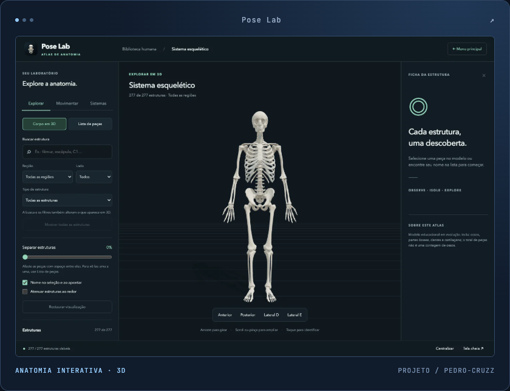
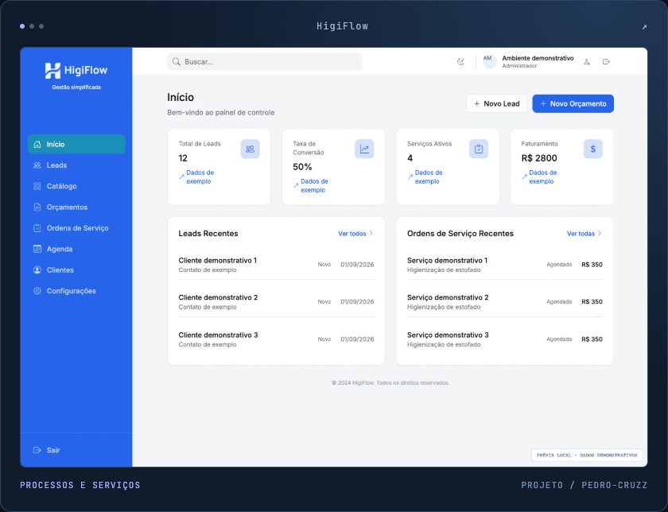
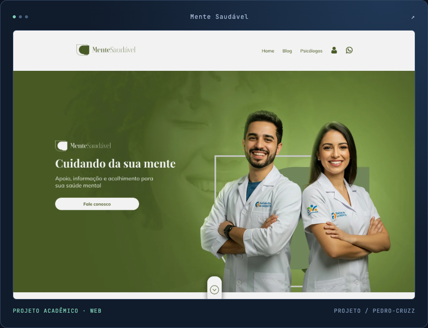
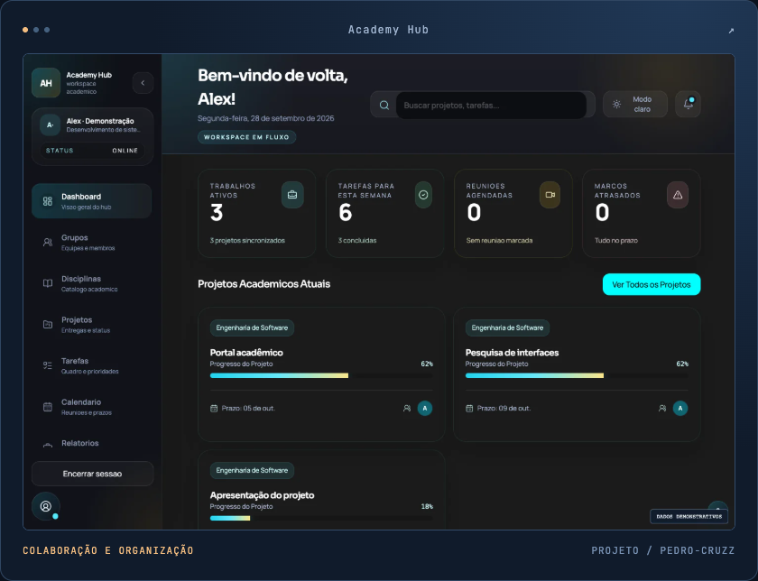
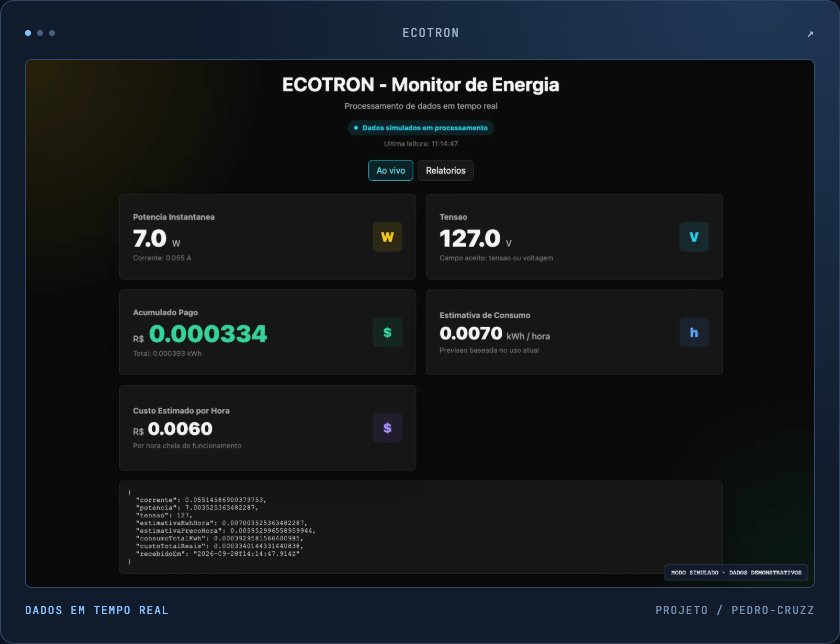

<!-- Apresentação de Pedro Henrique. Envie este README e a pasta assets juntos para o repositório pedro-cruzz/pedro-cruzz. -->
<h1 align="center">Olá, eu sou o Pedro! 👋</h1>

  <strong>Desenvolvimento de software · Python · Sistemas de gestão</strong>

  <a href="#sobre"><strong>Sobre</strong></a> &nbsp; · &nbsp;
  <a href="#tecnologias"><strong>Tecnologias</strong></a> &nbsp; · &nbsp;
  <a href="#projetos"><strong>Projetos</strong></a> &nbsp; · &nbsp;
  <a href="#contato"><strong>Contato</strong></a>

## 1- Sobre mim

Sou **Pedro Henrique**, formado em **Análise e Desenvolvimento de Sistemas** e atualmente cursando **Sistemas de Informação**. Desenvolvo sistemas de gestão e aplicações web, com foco em back-end, modelagem de dados e interfaces claras para processos reais.

No **IJA System**, do qual sou coautor, ajudei a substituir planilhas por um fluxo centralizado de solicitações de voo, equipes, ordens de serviço, frota e relatórios. Regras de acesso e integrações de mapas e endereços apoiam a operação diária.

No **HigiFlow**, a gestão de serviços vai do orçamento à execução. Trabalho com **Python, Flask, Django e bancos relacionais** no back-end e com **React e Next.js** nas interfaces, procurando entender cada rotina antes de definir telas e regras.

## 2- Tecnologias e ferramentas

**Back-end e dados**

  
  
  
  

APIs, regras de negócio e persistência com SQLAlchemy e Django ORM. Também utilizo SQLite em projetos e ambientes locais.

**Interfaces web**

  
  
  
  
  
  
  
  

Componentes, formulários, navegação e layouts responsivos, com atenção à identidade visual de cada projeto.

**Outras tecnologias**

  
  
  
  
  
  

Visualização no navegador, experiências instaláveis, dados em tempo real com Socket.IO e desenvolvimento mobile.

## 3- Projetos em destaque

Uma seleção que reúne aplicações profissionais, trabalhos acadêmicos e projetos pessoais. Clique nas imagens para conhecer os repositórios.

<table>
<tr>
<td width="50%" valign="top">

<h3>01 · IJA System</h3>

Sistema utilizado pela Oceano Azul e por UVIS de São Paulo em operações com drones. Conecta solicitações, ordens de serviço, equipes, frota e relatórios.

<strong>Python · Flask · PostgreSQL · SQLAlchemy</strong>

Permissões por perfil e escopo por prefeitura e região.

Coautoria com <a href="https://jpgomes035.github.io/joaopedro-portfolio/">João Pedro Gomes da Silva</a>.

<a href="https://github.com/pedro-cruzz/IJA-System"><strong>Explorar código ↗</strong></a>

</td>
<td width="50%" valign="top">

<h3>02 · Pose Lab</h3>

Atlas para explorar o corpo humano em 3D. Busca, seleção, isolamento e separação de estruturas, com controles de movimento e navegação por toque.

<strong>JavaScript · Three.js · WebGL · PWA</strong>

Uma exploração de modelos, catálogos e interação espacial.

<a href="https://github.com/pedro-cruzz/esqueleto-3d"><strong>Explorar código ↗</strong></a> &nbsp;·&nbsp; <a href="https://esqueleto-3d.vercel.app/">Abrir aplicação ↗</a>

</td>
</tr>
<tr>
<td width="50%" valign="top">

<h3>03 · HigiFlow</h3>

Gestão de serviços de higienização, do catálogo à execução. Reúne orçamentos, clientes, agenda, equipe técnica e ordens de serviço.

<strong>Python · Django · SQLite · Bootstrap</strong>

Aprovação de propostas conectada ao cadastro de clientes.

<a href="https://github.com/pedro-cruzz/gestao-higienizacao"><strong>Explorar código ↗</strong></a>

</td>
<td width="50%" valign="top">

<h3>04 · Mente Saudável</h3>

Interface de uma plataforma de informação sobre saúde mental, com diretório de psicólogos, perfis de pacientes e profissionais, favoritos e artigos.

<strong>React · TypeScript · Styled Components · Zod</strong>

Componentes, validação de formulários e integração com API.

<a href="https://github.com/pedro-cruzz/mente-saudavel"><strong>Explorar código ↗</strong></a>

</td>
</tr>
<tr>
<td width="50%" valign="top">

<h3>05 · Academy Hub</h3>

Hub para organizar disciplinas, equipes, projetos e tarefas acadêmicas. Conecta a interface React a uma API Django para reunir os trabalhos em grupo.

<strong>React · Django REST Framework · Python</strong>

Equipes, entregas e comunicação no contexto de cada projeto.

<a href="https://github.com/pedro-cruzz/academy-hub"><strong>Explorar código ↗</strong></a>

</td>
<td width="50%" valign="top">

<h3>06 · ECOTRON</h3>

Painel de energia com processamento de leituras, cálculo de consumo e estimativa de custos. Inclui um modo simulado para explorar o fluxo completo.

<strong>Node.js · Express · Socket.IO · JavaScript</strong>

Atualização da interface a partir de eventos do servidor.

<a href="https://github.com/pedro-cruzz/arduino_energia"><strong>Explorar código ↗</strong></a>

</td>
</tr>
</table>

Capturas das interfaces dos projetos. Painéis operacionais e o ECOTRON utilizam dados demonstrativos ou simulados nas imagens.

<strong>Mais 6 projetos — sites, aplicações e experimentos</strong>

 

| Projeto | O que explorei | Tecnologias |
| :--- | :--- | :--- |
| **[Oceano Azul](https://github.com/pedro-cruzz/Oceano-azul-page)** | Apresentação institucional, serviços, cases e contato. | Next.js · TypeScript · Tailwind CSS |
| **[IJA Drones](https://github.com/pedro-cruzz/ija-drones-page)** | Identidade visual e apresentação de soluções agrícolas e software. | Next.js · React · TypeScript |
| **[AeroFit](https://github.com/pedro-cruzz/AeroFit)** | Organização de treinos, exercícios, sessões e progresso. | Django · PostgreSQL · Bootstrap |
| **[Copa 2026](https://github.com/pedro-cruzz/copa-2026)** | Navegação por jogos, grupos e seleções, com elementos tridimensionais. | React · Three.js · Motion |
| **[Ctrl+Play](https://github.com/pedro-cruzz/Ctrl-Play)** | Organização e avaliação de filmes e séries em uma aplicação mobile. | Flutter · Dart |
| **[Capitalize Invest](https://github.com/pedro-cruzz/Investiment_Front-end)** | Cadastro e organização de investimentos com persistência no navegador. | HTML · CSS · JavaScript |

## 4- Como penso cada projeto

- **Entendimento do problema:** conhecer a rotina antes de definir as telas e as regras.
- **Organização dos dados:** conectar os registros e pensar em como serão consultados e atualizados.
- **Clareza na interface:** cuidar dos estados, dos formulários e da navegação em diferentes telas.
- **Critério técnico:** explicar decisões, verificar comportamentos e reconhecer o que ainda precisa evoluir.

## 5- Vamos conversar

Para conversar sobre projetos, trocar experiências ou apresentar uma oportunidade:

-  **LinkedIn:** [Pedro Henrique](https://www.linkedin.com/in/pedro-henrique-vilas-boas)
-  **E-mail:** [phcruzvilasboas@gmail.com](mailto:phcruzvilasboas@gmail.com)
-  **Instagram:** [@peedro.cruzz](https://www.instagram.com/peedro.cruzz)
-  **WhatsApp:** [Iniciar conversa](https://wa.me/5535998603656)
-  **Portfólio:** em breve. <!-- Quando publicar, troque "em breve" por [Acessar portfólio](URL_DO_PORTFOLIO). -->

---

  Pedro Henrique · <a href="https://github.com/pedro-cruzz">@pedro-cruzz</a>

